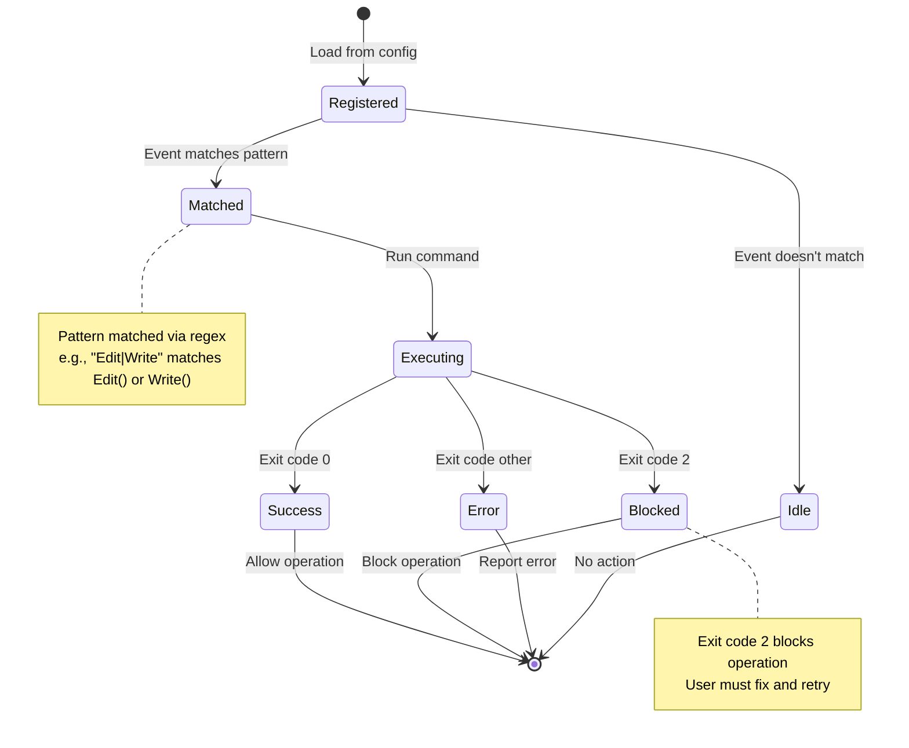

# Validation Hooks System Design
**Claude Code Orchestration System**

**Component**: Validation Hooks System
**Version**: 1.0
**Date**: 2025-11-16

---

## Overview

The Validation Hooks System provides quality gates through command execution at lifecycle events, enabling validation, formatting, and approval workflows.

### Key Requirements (R5.1-R5.5)
- Hook types: PreToolUse, PostToolUse, Stop, SessionStart, SessionEnd
- Exit code interpretation: 0=allow, 2=block, other=error
- Block-at-Submit pattern for quality gates
- Validation checkpoints between waves
- Functional testing enforcement

---

## Hook Lifecycle and Event Types

### Hook Event Types

```typescript
enum HookEvent {
  PreToolUse = "PreToolUse",      // Before tool execution
  PostToolUse = "PostToolUse",    // After tool execution
  Stop = "Stop",                  // Before session end
  SessionStart = "SessionStart",  // After session creation
  SessionEnd = "SessionEnd"       // After session end
}
```

### Hook Lifecycle State Machine



### Hook Configuration Schema

```json
{
  "hooks": {
    "PreToolUse": [
      {
        "matcher": "Bash(git push:*)",
        "hooks": [
          {
            "type": "command",
            "command": "test",
            "args": ["-f", "/tmp/functional-tests-passing"],
            "timeout": 5000,
            "continueOnError": false
          }
        ]
      }
    ],
    "PostToolUse": [
      {
        "matcher": "Edit|Write",
        "hooks": [
          {
            "type": "command",
            "command": "prettier",
            "args": ["--write", "$FILE_PATH"],
            "env": {
              "FILE_PATH": "${FILE_PATH}"
            },
            "timeout": 30000,
            "continueOnError": true
          }
        ]
      }
    ],
    "Stop": [
      {
        "matcher": "*",
        "hooks": [
          {
            "type": "command",
            "command": "cleanup.sh",
            "timeout": 10000
          }
        ]
      }
    ]
  }
}
```

---

## Exit Code Handling Logic

### Exit Code Interpreter

```python
class ExitCodeResult(Enum):
    ALLOW = 0      # Continue operation
    BLOCK = 2      # Block operation
    ERROR = -1     # Report error

class HookExecutor:
    """Execute validation hooks with exit code interpretation."""

    def execute_hook(
        self,
        hook: CommandHook,
        context: HookContext
    ) -> HookResult:
        """
        Execute hook command and interpret exit code.

        Exit Code Rules:
        - 0: Success, allow operation
        - 2: Block operation (quality gate failed)
        - Other: Error, report to user

        Args:
            hook: Hook configuration
            context: Execution context (tool, args, env vars)

        Returns:
            HookResult with exit code, stdout, stderr, action
        """
        # Build command
        command = [hook.command] + hook.args

        # Build environment
        env = {**os.environ, **(hook.env or {})}

        # Substitute context variables in env
        env = self._substitute_context_vars(env, context)

        # Execute command with timeout
        try:
            result = subprocess.run(
                command,
                env=env,
                capture_output=True,
                text=True,
                timeout=hook.timeout / 1000.0,  # Convert ms to seconds
                shell=False  # NEVER use shell=True (security)
            )

            exit_code = result.returncode
            stdout = result.stdout
            stderr = result.stderr

        except subprocess.TimeoutExpired:
            return HookResult(
                exitCode=-1,
                stdout="",
                stderr=f"Hook timed out after {hook.timeout}ms",
                action=ExitCodeResult.ERROR,
                blocked=False
            )

        # Interpret exit code
        if exit_code == 0:
            action = ExitCodeResult.ALLOW
            blocked = False
        elif exit_code == 2:
            action = ExitCodeResult.BLOCK
            blocked = True
        else:
            action = ExitCodeResult.ERROR
            blocked = False

        return HookResult(
            exitCode=exit_code,
            stdout=stdout,
            stderr=stderr,
            action=action,
            blocked=blocked
        )

    def _substitute_context_vars(
        self,
        env: dict,
        context: HookContext
    ) -> dict:
        """
        Substitute context variables in environment.

        Available variables:
        - $TOOL_NAME: Tool being executed (e.g., "Edit", "Bash")
        - $FILE_PATH: File path (for Edit/Write/Read)
        - $COMMAND: Bash command (for Bash tool)
        - $ARGS: Tool arguments (JSON)

        Security:
        - Use shlex.quote() to escape values
        - Never allow shell metacharacters
        """
        import shlex

        substitutions = {
            "TOOL_NAME": context.tool,
            "FILE_PATH": context.args.get("file_path", ""),
            "COMMAND": context.args.get("command", ""),
            "ARGS": json.dumps(context.args)
        }

        # Substitute and sanitize
        result = {}
        for key, value in env.items():
            for var_name, var_value in substitutions.items():
                placeholder = f"${{{var_name}}}"
                if placeholder in value:
                    # Sanitize value
                    safe_value = shlex.quote(str(var_value))
                    value = value.replace(placeholder, safe_value)

            result[key] = value

        return result
```

---

## Security Validation

### Command Injection Prevention

```python
class HookValidator:
    """Validate hook security before execution."""

    ALLOWED_COMMANDS = {
        # Code formatters
        "prettier", "black", "rustfmt", "gofmt",
        # Linters
        "eslint", "pylint", "ruff",
        # Testing
        "pytest", "jest", "go test", "cargo test",
        # Git
        "git",
        # Shell utilities
        "test", "echo", "cat", "ls"
    }

    def validate_hook(self, hook: CommandHook) -> ValidationResult:
        """
        Validate hook for security issues.

        Checks:
        1. Command in whitelist
        2. No shell metacharacters in args
        3. Environment vars safe
        4. Timeout reasonable (< 5 minutes)

        Args:
            hook: Hook configuration

        Returns:
            ValidationResult with pass/fail and warnings

        Raises:
            SecurityError: If hook unsafe
        """
        errors = []
        warnings = []

        # Check 1: Command whitelisted
        command_name = os.path.basename(hook.command)

        if command_name not in self.ALLOWED_COMMANDS:
            errors.append(
                f"Command '{command_name}' not in whitelist. "
                f"Allowed: {sorted(self.ALLOWED_COMMANDS)}"
            )

        # Check 2: No shell metacharacters in args
        for arg in hook.args:
            if self._has_shell_metacharacters(arg):
                errors.append(
                    f"Argument contains shell metacharacters: {arg}"
                )

        # Check 3: Timeout reasonable
        if hook.timeout > 300000:  # 5 minutes
            warnings.append(
                f"Timeout very high: {hook.timeout}ms. Consider reducing."
            )

        # Check 4: Environment vars safe
        if hook.env:
            for key, value in hook.env.items():
                if not key.isupper() or not key.replace("_", "").isalnum():
                    errors.append(
                        f"Invalid env var name: {key}. Must be UPPERCASE_WITH_UNDERSCORES"
                    )

        if errors:
            raise SecurityError(
                f"Hook validation failed:\n" + "\n".join(f"- {e}" for e in errors)
            )

        return ValidationResult(
            valid=True,
            warnings=warnings
        )

    def _has_shell_metacharacters(self, arg: str) -> bool:
        """Check if argument contains dangerous shell characters."""
        DANGEROUS_CHARS = {';', '&', '|', '`', '$', '(', ')', '<', '>', '\n'}

        return any(char in arg for char in DANGEROUS_CHARS)
```

### Argument Sanitization

```python
def sanitize_argument(arg: str) -> str:
    """
    Sanitize argument for safe subprocess execution.

    Strategy:
    - Use shlex.quote() for shell safety
    - Remove null bytes
    - Limit length (prevent DoS)

    Args:
        arg: Argument string

    Returns:
        Sanitized argument

    Raises:
        ValueError: If argument unsafe
    """
    import shlex

    # Remove null bytes
    arg = arg.replace('\0', '')

    # Limit length
    MAX_ARG_LENGTH = 10000
    if len(arg) > MAX_ARG_LENGTH:
        raise ValueError(f"Argument too long: {len(arg)} > {MAX_ARG_LENGTH}")

    # Shell quote
    return shlex.quote(arg)
```

---

## Hook Execution Patterns

### Pattern 1: Block-at-Submit (Quality Gate)

**Use Case**: Prevent git push unless tests pass

```json
{
  "hooks": {
    "PreToolUse": [
      {
        "matcher": "Bash(git push:*)",
        "hooks": [
          {
            "type": "command",
            "command": "test",
            "args": ["-f", "/tmp/functional-tests-passing"],
            "timeout": 5000
          }
        ]
      }
    ]
  }
}
```

**Workflow**:
1. Agent calls `Bash("git push origin main")`
2. Hook matches pattern `Bash(git push:*)`
3. Executes: `test -f /tmp/functional-tests-passing`
4. If file exists (exit 0): Allow push
5. If file missing (exit 1): Block push with error

### Pattern 2: Auto-Format (PostToolUse)

**Use Case**: Auto-format code after editing

```json
{
  "hooks": {
    "PostToolUse": [
      {
        "matcher": "Edit|Write",
        "hooks": [
          {
            "type": "command",
            "command": "prettier",
            "args": ["--write", "$FILE_PATH"],
            "env": {"FILE_PATH": "${FILE_PATH}"},
            "timeout": 30000,
            "continueOnError": true
          }
        ]
      }
    ]
  }
}
```

**Workflow**:
1. Agent calls `Edit("src/app.ts", ...)`
2. Edit completes successfully
3. Hook matches pattern `Edit|Write`
4. Executes: `prettier --write src/app.ts`
5. Continue regardless of exit code (continueOnError: true)

### Pattern 3: Session Cleanup

**Use Case**: Cleanup temp files on session end

```json
{
  "hooks": {
    "SessionEnd": [
      {
        "matcher": "*",
        "hooks": [
          {
            "type": "command",
            "command": "rm",
            "args": ["-rf", "/tmp/claude-temp-*"],
            "timeout": 10000
          }
        ]
      }
    ]
  }
}
```

---

## Matcher Engine (Regex Patterns)

### Pattern Matching Algorithm

```python
import re

class HookMatcher:
    """Match tool invocations against hook patterns."""

    def matches_pattern(self, pattern: str, tool: str, args: dict = None) -> bool:
        """
        Check if tool invocation matches hook pattern.

        Pattern Syntax:
        - Literal: "Edit" matches only Edit()
        - Pipe: "Edit|Write" matches Edit() or Write()
        - Wildcard: "Bash(*)" matches any Bash command
        - Specific: "Bash(git push:*)" matches git push with any args
        - Universal: "*" matches all tools

        Args:
            pattern: Hook matcher pattern
            tool: Tool name (e.g., "Edit", "Bash")
            args: Tool arguments (optional)

        Returns:
            True if pattern matches tool invocation
        """
        # Universal matcher
        if pattern == "*":
            return True

        # Parse pattern
        if "(" in pattern:
            # Pattern with arguments: "Bash(git push:*)"
            tool_pattern, arg_pattern = pattern.split("(", 1)
            arg_pattern = arg_pattern.rstrip(")")

            # Check tool name
            if not self._matches_tool_name(tool_pattern, tool):
                return False

            # Check arguments
            if args and "command" in args:
                return self._matches_command(arg_pattern, args["command"])
            else:
                return True  # No args to check

        else:
            # Simple pattern: "Edit|Write"
            return self._matches_tool_name(pattern, tool)

    def _matches_tool_name(self, pattern: str, tool: str) -> bool:
        """Match tool name against pattern (supports pipe separator)."""

        # Split on pipe
        alternatives = pattern.split("|")

        # Check if tool matches any alternative
        return tool in alternatives

    def _matches_command(self, pattern: str, command: str) -> bool:
        """
        Match command string against pattern.

        Pattern Syntax:
        - "*": Match any command
        - "git push:*": Match "git push" with any args
        - "rm:*": Match "rm" command
        """
        if pattern == "*":
            return True

        # Convert glob pattern to regex
        # "git push:*" → "^git push"
        if pattern.endswith(":*"):
            prefix = pattern[:-2]  # Remove ":*"
            return command.startswith(prefix)

        # Exact match
        return pattern == command
```

### Example Pattern Matching

```python
matcher = HookMatcher()

# Test 1: Simple pattern
assert matcher.matches_pattern("Edit", "Edit")
assert not matcher.matches_pattern("Edit", "Write")

# Test 2: Pipe pattern
assert matcher.matches_pattern("Edit|Write", "Edit")
assert matcher.matches_pattern("Edit|Write", "Write")
assert not matcher.matches_pattern("Edit|Write", "Read")

# Test 3: Bash command pattern
assert matcher.matches_pattern(
    "Bash(git push:*)",
    "Bash",
    {"command": "git push origin main"}
)

assert not matcher.matches_pattern(
    "Bash(git push:*)",
    "Bash",
    {"command": "git pull"}
)

# Test 4: Universal pattern
assert matcher.matches_pattern("*", "AnyTool")

print("✅ All pattern matching tests passed")
```

---

## Logging and Observability

### Hook Execution Logging

```python
class HookLogger:
    """Log hook executions for debugging."""

    def __init__(self, log_file: str = "~/.config/claude/logs/hooks.log"):
        self.log_file = os.path.expanduser(log_file)

    def log_execution(
        self,
        hook_event: HookEvent,
        pattern: str,
        command: str,
        result: HookResult
    ):
        """
        Log hook execution with full details.

        Log Format (JSON):
        {
          "timestamp": "2025-11-16T10:30:00.000Z",
          "event": "PreToolUse",
          "pattern": "Bash(git push:*)",
          "command": "test -f /tmp/functional-tests-passing",
          "exitCode": 0,
          "duration_ms": 123,
          "blocked": false
        }
        """
        log_entry = {
            "timestamp": datetime.utcnow().isoformat() + "Z",
            "event": hook_event.value,
            "pattern": pattern,
            "command": command,
            "exitCode": result.exitCode,
            "duration_ms": result.duration_ms,
            "blocked": result.blocked
        }

        # Append to log file
        with open(self.log_file, 'a') as f:
            f.write(json.dumps(log_entry) + '\n')
```

---

## Functional Testing

```python
def test_block_at_submit():
    """Test PreToolUse hook blocks git push without tests."""

    # Setup: Remove validation file
    if os.path.exists("/tmp/functional-tests-passing"):
        os.remove("/tmp/functional-tests-passing")

    # Execute hook
    hook = CommandHook(
        type="command",
        command="test",
        args=["-f", "/tmp/functional-tests-passing"],
        timeout=5000
    )

    context = HookContext(tool="Bash", args={"command": "git push origin main"})

    result = executor.execute_hook(hook, context)

    # Verify: Blocked (exit code 1, not 0)
    assert result.blocked == False  # test exits 1, not 2
    assert result.exitCode == 1

    # Create validation file
    with open("/tmp/functional-tests-passing", 'w') as f:
        f.write("tests passed")

    # Execute hook again
    result = executor.execute_hook(hook, context)

    # Verify: Allowed (exit code 0)
    assert result.blocked == False
    assert result.exitCode == 0

    print("✅ Test passed: Block-at-submit works")


def test_pattern_matching():
    """Test hook pattern matching."""

    matcher = HookMatcher()

    # Test Bash command pattern
    assert matcher.matches_pattern(
        "Bash(git push:*)",
        "Bash",
        {"command": "git push origin main"}
    )

    assert not matcher.matches_pattern(
        "Bash(git push:*)",
        "Bash",
        {"command": "git pull"}
    )

    print("✅ Test passed: Pattern matching works")
```

---

**Document Status**: COMPLETE ✅
**All 6 Architecture Documents Complete**
**Ready for Git Commit and Serena Save**
