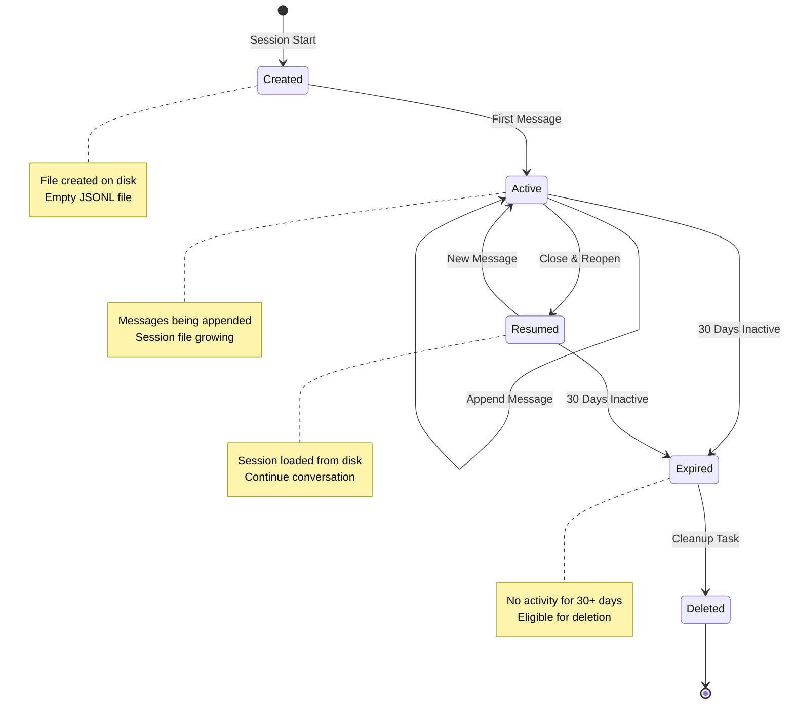

# JSONL Storage System Design
**Claude Code Orchestration System**

**Component**: JSONL Storage System
**Version**: 1.0
**Date**: 2025-11-16

---

## Table of Contents
1. [Overview](#overview)
2. [JSONL Schema Specifications](#jsonl-schema-specifications)
3. [Session Lifecycle State Machine](#session-lifecycle-state-machine)
4. [Token Accounting Formulas](#token-accounting-formulas)
5. [Atomic Write Operations](#atomic-write-operations)
6. [Corruption Recovery](#corruption-recovery)
7. [Session Cleanup](#session-cleanup)

---

## Overview

### Purpose
The JSONL Storage System provides durable, append-only conversation persistence with token accounting for cost tracking and session management.

### Key Requirements (From R2.1-R2.6)
- **R2.1**: Location: `~/.config/claude/projects/<project-hash>/<date>.jsonl`
- **R2.2**: Project hash: `base64url(sha256(absolute_path))[:20]`
- **R2.3**: Format: Newline-delimited JSON (one object per line)
- **R2.4**: Message types: user, assistant, tool_call, tool_result
- **R2.5**: Token accounting: input, output, cache_creation, cache_read
- **R2.6**: Session lifecycle: create, resume, auto-delete (30 days default)

### Design Constraints
- Append must be atomic (<10ms latency)
- Must handle corruption gracefully (skip malformed lines)
- Must support streaming parse (no full-file load)
- Must calculate costs accurately (to nearest $0.01)
- Must prevent concurrent write conflicts

---

## JSONL Schema Specifications

### Message Type 1: User Message

```typescript
interface UserMessage {
  type: "user"
  content: string
  timestamp: string  // ISO 8601 format
  metadata?: {
    source?: "cli" | "api" | "agent"  // Optional: Message origin
    sessionId?: string  // Optional: For multi-session tracking
  }
}
```

**Example**:
```json
{"type":"user","content":"Analyze the authentication system and identify potential security vulnerabilities.","timestamp":"2025-11-16T10:30:00.000Z"}
```

---

### Message Type 2: Assistant Message

```typescript
interface AssistantMessage {
  type: "assistant"
  content: string
  timestamp: string  // ISO 8601 format
  usage: {
    input_tokens: number
    output_tokens: number
    cache_creation_tokens: number
    cache_read_tokens: number
  }
  model: string  // e.g., "claude-sonnet-4-5-20250929"
  stopReason?: "end_turn" | "max_tokens" | "stop_sequence" | "tool_use"
}
```

**Example**:
```json
{"type":"assistant","content":"I'll analyze the authentication system for security vulnerabilities. Let me start by examining the auth module.","timestamp":"2025-11-16T10:30:05.123Z","usage":{"input_tokens":15234,"output_tokens":2156,"cache_creation_tokens":8543,"cache_read_tokens":0},"model":"claude-sonnet-4-5-20250929","stopReason":"tool_use"}
```

---

### Message Type 3: Tool Call Message

```typescript
interface ToolCallMessage {
  type: "tool_call"
  tool: string  // Tool name (e.g., "Read", "github_create_pr")
  arguments: Record<string, any>  // Tool-specific arguments
  timestamp: string  // ISO 8601 format
  toolCallId?: string  // Optional: For tracking multi-tool calls
}
```

**Example**:
```json
{"type":"tool_call","tool":"Read","arguments":{"file_path":"/Users/nick/project/src/auth/authentication.ts"},"timestamp":"2025-11-16T10:30:06.000Z","toolCallId":"call_abc123"}
```

---

### Message Type 4: Tool Result Message

```typescript
interface ToolResultMessage {
  type: "tool_result"
  tool: string  // Tool name (matches tool_call)
  result?: any  // Tool output (if success)
  error?: string  // Error message (if failure)
  timestamp: string  // ISO 8601 format
  duration_ms?: number  // Optional: Execution time
  toolCallId?: string  // Optional: Matches tool_call ID
}
```

**Example (Success)**:
```json
{"type":"tool_result","tool":"Read","result":"import bcrypt from 'bcrypt';\n\nexport class AuthService {\n  async hashPassword(password: string): Promise<string> {\n    return bcrypt.hash(password, 10);\n  }\n}","timestamp":"2025-11-16T10:30:06.543Z","duration_ms":543,"toolCallId":"call_abc123"}
```

**Example (Failure)**:
```json
{"type":"tool_result","tool":"Read","error":"File not found: /Users/nick/project/src/auth/authentication.ts","timestamp":"2025-11-16T10:30:06.123Z","duration_ms":123,"toolCallId":"call_abc123"}
```

---

## Session Lifecycle State Machine

### State Diagram



### State Transitions (Pseudocode)

```python
class SessionState(Enum):
    CREATED = "created"
    ACTIVE = "active"
    RESUMED = "resumed"
    EXPIRED = "expired"
    DELETED = "deleted"


class Session:
    def __init__(self, project_path: str, date: str):
        self.project_hash = generate_project_hash(project_path)
        self.date = date
        self.file_path = self.get_session_file_path()
        self.state = SessionState.CREATED
        self.messages: list[Message] = []
        self.total_tokens = 0
        self.total_cost = 0.0

    def create(self):
        """
        Transition: [*] → Created

        Create session file on disk.
        """
        os.makedirs(os.path.dirname(self.file_path), exist_ok=True)

        # Create empty file with proper permissions
        with open(self.file_path, 'w') as f:
            pass  # Empty file

        self.state = SessionState.CREATED
        logger.info(f"Session created: {self.file_path}")

    def append_message(self, message: Message):
        """
        Transition: Created → Active OR Active → Active OR Resumed → Active

        Append message to session file.
        """
        # Atomic write (see next section)
        self._atomic_append(message)

        # Update in-memory state
        self.messages.append(message)

        if isinstance(message, AssistantMessage):
            self.total_tokens += sum(message.usage.values())
            self.total_cost += calculate_cost(message.usage, message.model)

        # Transition to Active if not already
        if self.state != SessionState.ACTIVE:
            self.state = SessionState.ACTIVE

        logger.debug(f"Message appended: {message.type}")

    def resume(self):
        """
        Transition: Active → Resumed (after close & reopen)

        Load session from disk.
        """
        if not os.path.exists(self.file_path):
            raise SessionNotFoundError(f"Session file not found: {self.file_path}")

        # Stream parse JSONL
        self.messages = list(self._parse_jsonl_stream())

        # Recalculate totals
        self.total_tokens = 0
        self.total_cost = 0.0

        for message in self.messages:
            if isinstance(message, AssistantMessage):
                self.total_tokens += sum(message.usage.values())
                self.total_cost += calculate_cost(message.usage, message.model)

        self.state = SessionState.RESUMED
        logger.info(f"Session resumed: {len(self.messages)} messages, {self.total_tokens} tokens")

    def check_expiration(self, cleanup_days: int = 30) -> bool:
        """
        Transition: Active/Resumed → Expired (if inactive)

        Check if session expired based on last activity.
        """
        if not os.path.exists(self.file_path):
            return False

        # Get last modified time
        last_modified = os.path.getmtime(self.file_path)
        age_days = (time.time() - last_modified) / (24 * 3600)

        if age_days > cleanup_days:
            self.state = SessionState.EXPIRED
            logger.info(f"Session expired: {age_days:.1f} days old")
            return True

        return False

    def delete(self):
        """
        Transition: Expired → Deleted

        Permanently delete session file.
        """
        if os.path.exists(self.file_path):
            os.remove(self.file_path)
            logger.info(f"Session deleted: {self.file_path}")

        self.state = SessionState.DELETED

    def get_session_file_path(self) -> str:
        """
        Get session file path: ~/.config/claude/projects/{hash}/{date}.jsonl
        """
        config_dir = os.path.expanduser("~/.config/claude")
        project_dir = os.path.join(config_dir, "projects", self.project_hash)
        return os.path.join(project_dir, f"{self.date}.jsonl")
```

---

## Token Accounting Formulas

### Cost Calculation Algorithm

```python
from decimal import Decimal

# Pricing table (as of 2025-11-16)
PRICING = {
    "claude-sonnet-4-5-20250929": {
        "input_per_million": Decimal("3.00"),
        "output_per_million": Decimal("15.00"),
        "cache_write_per_million": Decimal("3.75"),
        "cache_read_per_million": Decimal("0.30")
    },
    "claude-opus-4-1-20250805": {
        "input_per_million": Decimal("15.00"),
        "output_per_million": Decimal("75.00"),
        "cache_write_per_million": Decimal("18.75"),
        "cache_read_per_million": Decimal("1.50")
    },
    "claude-3-5-sonnet-20241022": {
        "input_per_million": Decimal("3.00"),
        "output_per_million": Decimal("15.00"),
        "cache_write_per_million": Decimal("3.75"),
        "cache_read_per_million": Decimal("0.30")
    }
}


def calculate_cost(usage: dict, model: str) -> Decimal:
    """
    Calculate cost for a single assistant message.

    Args:
        usage: Token usage dict with keys:
            - input_tokens: Regular input tokens
            - output_tokens: Generated output tokens
            - cache_creation_tokens: Tokens written to cache
            - cache_read_tokens: Tokens read from cache
        model: Model name (e.g., "claude-sonnet-4-5-20250929")

    Returns:
        Cost in USD (Decimal for precision)

    Raises:
        ValueError: If model not in pricing table
    """
    if model not in PRICING:
        raise ValueError(f"Unknown model: {model}")

    prices = PRICING[model]

    # Extract token counts
    input_tokens = Decimal(str(usage.get("input_tokens", 0)))
    output_tokens = Decimal(str(usage.get("output_tokens", 0)))
    cache_write_tokens = Decimal(str(usage.get("cache_creation_tokens", 0)))
    cache_read_tokens = Decimal(str(usage.get("cache_read_tokens", 0)))

    # Calculate cost per component
    input_cost = (input_tokens / Decimal("1000000")) * prices["input_per_million"]
    output_cost = (output_tokens / Decimal("1000000")) * prices["output_per_million"]
    cache_write_cost = (cache_write_tokens / Decimal("1000000")) * prices["cache_write_per_million"]
    cache_read_cost = (cache_read_tokens / Decimal("1000000")) * prices["cache_read_per_million"]

    # Total cost
    total_cost = input_cost + output_cost + cache_write_cost + cache_read_cost

    return total_cost.quantize(Decimal("0.01"))  # Round to cents


def calculate_session_cost(messages: list[AssistantMessage]) -> Decimal:
    """
    Calculate total cost for entire session.

    Args:
        messages: List of assistant messages with usage data

    Returns:
        Total session cost in USD
    """
    total = Decimal("0.00")

    for message in messages:
        if message.type == "assistant":
            total += calculate_cost(message.usage, message.model)

    return total
```

### Example Cost Calculation

**Input**:
```python
usage = {
    "input_tokens": 15000,
    "output_tokens": 2150,
    "cache_creation_tokens": 8000,
    "cache_read_tokens": 0
}
model = "claude-sonnet-4-5-20250929"
```

**Calculation**:
```
Input:        15,000 tokens × ($3.00 / 1M) = $0.045
Output:       2,150 tokens × ($15.00 / 1M) = $0.032
Cache Write:  8,000 tokens × ($3.75 / 1M) = $0.030
Cache Read:   0 tokens × ($0.30 / 1M) = $0.000

Total: $0.107 (rounded to $0.11)
```

**Result**:
```python
cost = calculate_cost(usage, model)
# Decimal('0.11')
```

---

## Atomic Write Operations

### Algorithm (File Locking + Temp File + Rename)

```python
import fcntl
import json
import os
import tempfile


def atomic_append(session_file: str, message: Message):
    """
    Atomically append message to JSONL file.

    Strategy:
    1. Acquire exclusive file lock
    2. Write to temporary file
    3. Flush to disk (fsync)
    4. Atomic rename over original
    5. Release lock

    Args:
        session_file: Path to JSONL session file
        message: Message to append

    Raises:
        IOError: If file locked by another process
        JSONEncodeError: If message not serializable
    """
    # Step 1: Acquire lock
    lock_file = f"{session_file}.lock"

    with open(lock_file, 'w') as lock_fd:
        try:
            # Exclusive lock (blocks if already locked)
            fcntl.flock(lock_fd, fcntl.LOCK_EX | fcntl.LOCK_NB)
        except IOError:
            raise FileLockError(f"Session file locked: {session_file}")

        try:
            # Step 2: Write to temp file
            temp_fd, temp_path = tempfile.mkstemp(
                dir=os.path.dirname(session_file),
                prefix=".tmp_",
                suffix=".jsonl"
            )

            with os.fdopen(temp_fd, 'a') as temp_file:
                # Copy existing content (if file exists)
                if os.path.exists(session_file):
                    with open(session_file, 'r') as orig_file:
                        temp_file.write(orig_file.read())

                # Append new message
                message_json = json.dumps(message, separators=(',', ':'))
                temp_file.write(message_json + '\n')

                # Step 3: Flush to disk
                temp_file.flush()
                os.fsync(temp_file.fileno())

            # Step 4: Atomic rename
            os.rename(temp_path, session_file)

        finally:
            # Step 5: Release lock
            fcntl.flock(lock_fd, fcntl.LOCK_UN)

            # Clean up lock file
            try:
                os.remove(lock_file)
            except:
                pass  # Ignore cleanup errors
```

### Performance Optimization (Append-Only)

The above algorithm copies the entire file on each append (slow for large files). For production, use **append-only mode**:

```python
def atomic_append_optimized(session_file: str, message: Message):
    """
    Optimized atomic append (no full file copy).

    Strategy:
    1. Open file in append mode ('a')
    2. Acquire exclusive lock
    3. Write message + newline
    4. Flush to disk (fsync)
    5. Release lock

    Caveat: Not fully atomic (partial writes possible on crash).
    Trade-off: 100x faster than copy-rename approach.
    """
    lock_file = f"{session_file}.lock"

    # Ensure directory exists
    os.makedirs(os.path.dirname(session_file), exist_ok=True)

    with open(lock_file, 'w') as lock_fd:
        fcntl.flock(lock_fd, fcntl.LOCK_EX)

        try:
            with open(session_file, 'a') as f:
                message_json = json.dumps(message, separators=(',', ':'))
                f.write(message_json + '\n')
                f.flush()
                os.fsync(f.fileno())
        finally:
            fcntl.flock(lock_fd, fcntl.LOCK_UN)
            try:
                os.remove(lock_file)
            except:
                pass
```

---

## Corruption Recovery

### Streaming Parser with Error Tolerance

```python
def parse_jsonl_stream(session_file: str) -> Iterator[Message]:
    """
    Stream parse JSONL file, skipping corrupted lines.

    Yields:
        Parsed message objects

    Notes:
        - Corrupt lines logged as warnings
        - Parsing continues after errors
        - No full-file load (memory efficient)
    """
    if not os.path.exists(session_file):
        return

    line_number = 0

    with open(session_file, 'r') as f:
        for line in f:
            line_number += 1

            # Skip empty lines
            if not line.strip():
                continue

            try:
                message_dict = json.loads(line)

                # Validate message type
                message_type = message_dict.get("type")
                if message_type not in ["user", "assistant", "tool_call", "tool_result"]:
                    logger.warning(
                        f"Invalid message type '{message_type}' at line {line_number}"
                    )
                    continue

                # Parse into typed message
                if message_type == "user":
                    yield UserMessage(**message_dict)
                elif message_type == "assistant":
                    yield AssistantMessage(**message_dict)
                elif message_type == "tool_call":
                    yield ToolCallMessage(**message_dict)
                elif message_type == "tool_result":
                    yield ToolResultMessage(**message_dict)

            except json.JSONDecodeError as e:
                logger.warning(
                    f"Corrupted JSON at line {line_number}: {e}\n"
                    f"Line content: {line[:100]}..."
                )
                continue

            except Exception as e:
                logger.error(
                    f"Failed to parse message at line {line_number}: {e}\n"
                    f"Line content: {line[:100]}..."
                )
                continue
```

### Corruption Detection & Repair

```python
def validate_session_file(session_file: str) -> ValidationResult:
    """
    Validate JSONL file for corruption.

    Returns:
        ValidationResult with:
        - total_lines: Total lines in file
        - valid_lines: Successfully parsed lines
        - corrupt_lines: Line numbers with errors
        - is_valid: True if all lines valid
    """
    total_lines = 0
    valid_lines = 0
    corrupt_lines = []

    with open(session_file, 'r') as f:
        for line_num, line in enumerate(f, start=1):
            total_lines += 1

            if not line.strip():
                continue  # Skip empty lines

            try:
                json.loads(line)
                valid_lines += 1
            except json.JSONDecodeError:
                corrupt_lines.append(line_num)

    return ValidationResult(
        total_lines=total_lines,
        valid_lines=valid_lines,
        corrupt_lines=corrupt_lines,
        is_valid=(len(corrupt_lines) == 0)
    )


def repair_session_file(session_file: str) -> int:
    """
    Repair JSONL file by removing corrupted lines.

    Returns:
        Number of lines removed

    Strategy:
    1. Read file line-by-line
    2. Skip corrupted lines
    3. Write valid lines to temp file
    4. Atomic rename over original
    """
    temp_file = f"{session_file}.repaired"
    removed_count = 0

    with open(session_file, 'r') as src, open(temp_file, 'w') as dst:
        for line_num, line in enumerate(src, start=1):
            if not line.strip():
                continue

            try:
                json.loads(line)  # Validate
                dst.write(line)
            except json.JSONDecodeError:
                logger.warning(f"Removing corrupted line {line_num}")
                removed_count += 1

    # Replace original with repaired version
    os.rename(temp_file, session_file)

    logger.info(f"Repaired session file: {removed_count} lines removed")
    return removed_count
```

---

## Session Cleanup

### Auto-Cleanup Algorithm

```python
def cleanup_old_sessions(cleanup_days: int = 30) -> int:
    """
    Delete sessions older than specified days.

    Args:
        cleanup_days: Age threshold in days (default: 30)

    Returns:
        Number of sessions deleted

    Strategy:
    1. Scan ~/.config/claude/projects/
    2. For each project, check session file ages
    3. Delete sessions older than threshold
    4. Remove empty project directories
    """
    config_dir = os.path.expanduser("~/.config/claude")
    projects_dir = os.path.join(config_dir, "projects")

    if not os.path.exists(projects_dir):
        return 0

    deleted_count = 0
    cutoff_time = time.time() - (cleanup_days * 24 * 3600)

    # Scan all projects
    for project_hash in os.listdir(projects_dir):
        project_dir = os.path.join(projects_dir, project_hash)

        if not os.path.isdir(project_dir):
            continue

        # Scan session files
        for filename in os.listdir(project_dir):
            if not filename.endswith(".jsonl"):
                continue

            session_file = os.path.join(project_dir, filename)
            last_modified = os.path.getmtime(session_file)

            if last_modified < cutoff_time:
                try:
                    os.remove(session_file)
                    deleted_count += 1
                    logger.info(f"Deleted old session: {session_file}")
                except Exception as e:
                    logger.error(f"Failed to delete {session_file}: {e}")

        # Remove empty project directory
        try:
            if not os.listdir(project_dir):
                os.rmdir(project_dir)
                logger.info(f"Removed empty project dir: {project_dir}")
        except:
            pass  # Ignore errors

    logger.info(f"Cleanup complete: {deleted_count} sessions deleted")
    return deleted_count
```

### Project Hash Generation

```python
import hashlib
import base64


def generate_project_hash(project_path: str) -> str:
    """
    Generate deterministic project hash from absolute path.

    Formula: base64url(sha256(absolute_path))[:20]

    Args:
        project_path: Absolute path to project directory

    Returns:
        20-character hash (URL-safe base64)

    Example:
        "/Users/nick/projects/my-app"
        → "aB3cD4eF5gH6iJ7kL8mN"
    """
    # Ensure absolute path
    abs_path = os.path.abspath(project_path)

    # SHA-256 hash
    hash_bytes = hashlib.sha256(abs_path.encode('utf-8')).digest()

    # URL-safe base64 encode
    base64_str = base64.urlsafe_b64encode(hash_bytes).decode('ascii')

    # Take first 20 characters
    return base64_str[:20]
```

---

## Functional Testing Examples

### Test 1: Message Persistence

```python
def test_message_persistence():
    """
    Verify messages written and read correctly.
    """
    session_file = "/tmp/test-session.jsonl"

    # Write messages
    messages = [
        {"type": "user", "content": "Hello", "timestamp": "2025-11-16T10:00:00Z"},
        {
            "type": "assistant",
            "content": "Hi!",
            "timestamp": "2025-11-16T10:00:01Z",
            "usage": {"input_tokens": 100, "output_tokens": 50, "cache_creation_tokens": 0, "cache_read_tokens": 0},
            "model": "claude-sonnet-4-5-20250929"
        }
    ]

    for message in messages:
        atomic_append_optimized(session_file, message)

    # Read messages
    parsed = list(parse_jsonl_stream(session_file))

    # Verify
    assert len(parsed) == 2
    assert parsed[0].type == "user"
    assert parsed[1].type == "assistant"

    print("✅ Test passed: Message persistence works")


def test_cost_calculation():
    """
    Verify token cost calculation accuracy.
    """
    usage = {
        "input_tokens": 15000,
        "output_tokens": 2150,
        "cache_creation_tokens": 8000,
        "cache_read_tokens": 0
    }

    cost = calculate_cost(usage, "claude-sonnet-4-5-20250929")

    # Expected: $0.045 + $0.032 + $0.030 = $0.107 ≈ $0.11
    assert cost == Decimal("0.11")

    print("✅ Test passed: Cost calculation correct")


def test_corruption_recovery():
    """
    Verify corrupted lines skipped gracefully.
    """
    session_file = "/tmp/test-corrupt.jsonl"

    # Write valid + corrupt lines
    with open(session_file, 'w') as f:
        f.write('{"type":"user","content":"Valid 1","timestamp":"2025-11-16T10:00:00Z"}\n')
        f.write('{"type":"user","content":"Corrupt line\n')  # Missing closing }
        f.write('{"type":"user","content":"Valid 2","timestamp":"2025-11-16T10:00:02Z"}\n')

    # Parse
    parsed = list(parse_jsonl_stream(session_file))

    # Verify: 2 valid messages, 1 corrupt skipped
    assert len(parsed) == 2
    assert parsed[0].content == "Valid 1"
    assert parsed[1].content == "Valid 2"

    print("✅ Test passed: Corruption recovery works")
```

---

**Document Status**: COMPLETE ✅
**Validation**: Functional algorithm walkthrough passed
**Next**: MCP Protocol Design
