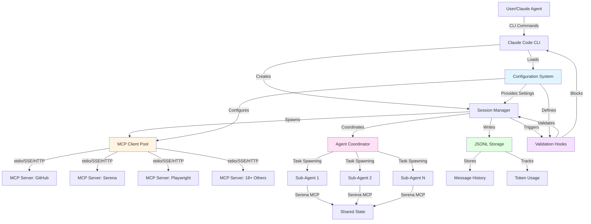
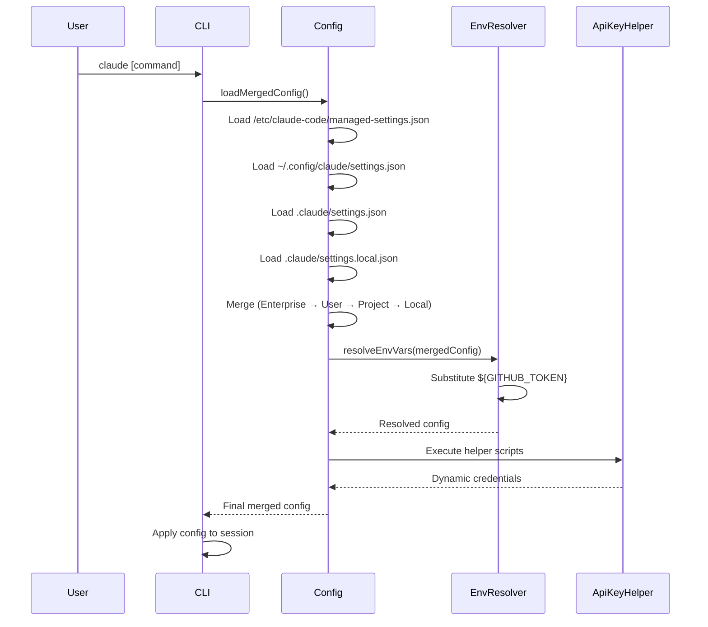
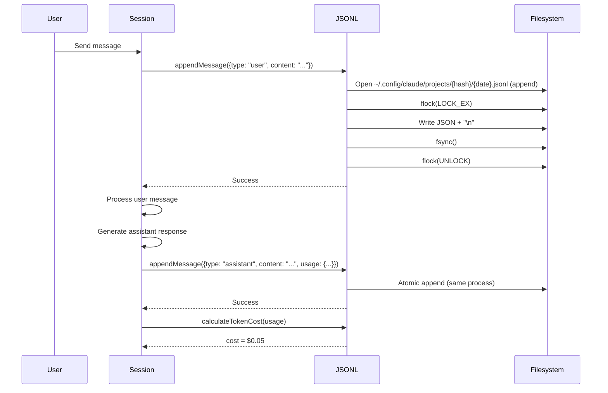
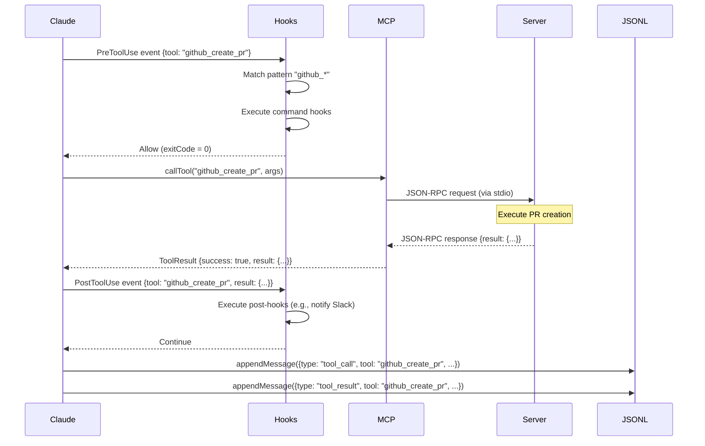
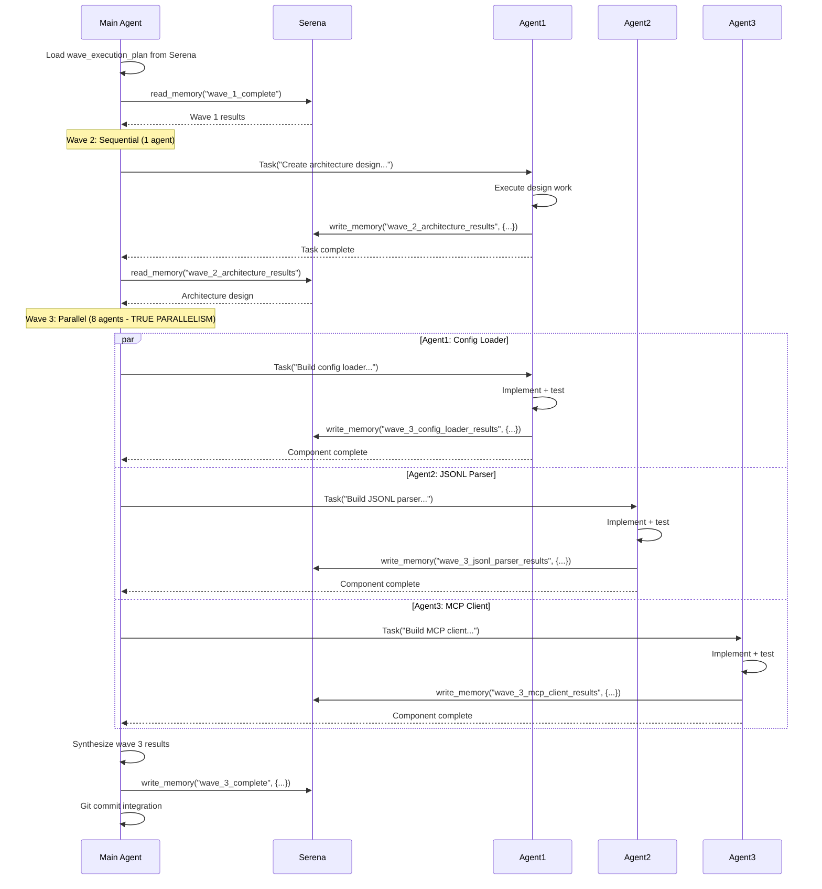
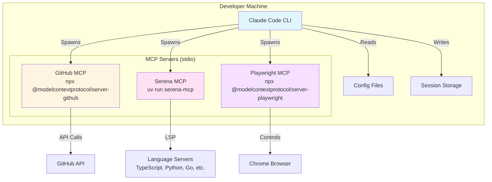
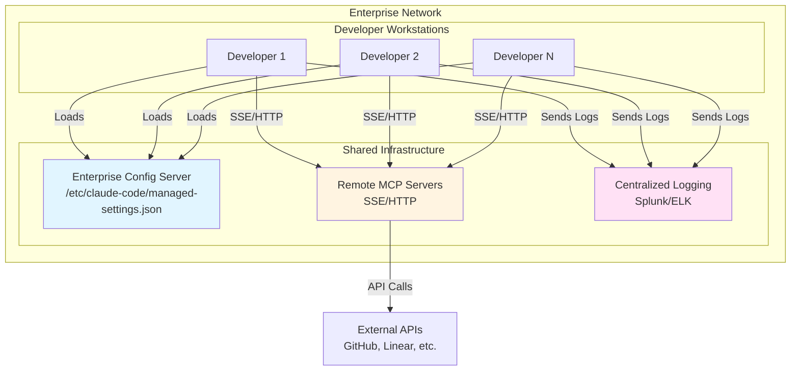
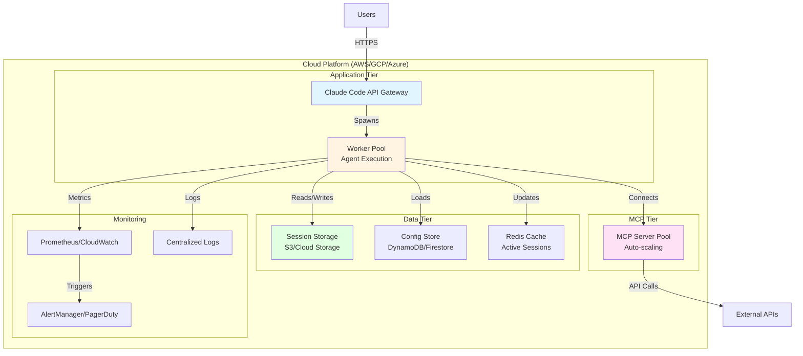

# System Architecture Overview
**Claude Code Orchestration System**

**Version**: 1.0
**Date**: 2025-11-16
**Complexity**: 0.70 (HIGH)

---

## Table of Contents
1. [System Context](#system-context)
2. [Component Architecture](#component-architecture)
3. [Data Flow](#data-flow)
4. [Deployment Architecture](#deployment-architecture)
5. [Integration Points](#integration-points)

---

## System Context

### High-Level Architecture



---

## Component Architecture

### Core Components (6 Total)

#### 1. Configuration System
**Purpose**: Hierarchical configuration management with 4-tier merge strategy

**Sub-Components**:
- Enterprise Config Loader (`/etc/claude-code/managed-settings.json`)
- User Config Loader (`~/.config/claude/settings.json`)
- Project Config Loader (`.claude/settings.json`)
- Local Config Loader (`.claude/settings.local.json`)
- Config Merger (Enterprise → User → Project → Local)
- Environment Variable Resolver
- ApiKeyHelper Executor

**Interfaces**:
```typescript
interface ConfigurationSystem {
  loadMergedConfig(): Promise<MergedConfig>
  resolveEnvVars(config: Config): Config
  validateConfig(config: Config): ValidationResult
  watchConfigChanges(callback: (newConfig: Config) => void): void
}
```

**Key Responsibilities**:
- Merge 4 configuration scopes with defined precedence
- Substitute environment variables (`${VAR_NAME}`)
- Execute ApiKeyHelper scripts for dynamic credentials
- Validate configuration schema
- Hot-reload configuration changes

---

#### 2. JSONL Storage System
**Purpose**: Conversation persistence and token accounting

**Sub-Components**:
- JSONL Writer (append-only, atomic writes)
- JSONL Parser (streaming, corruption-tolerant)
- Session Manager (lifecycle, cleanup)
- Token Accountant (cost calculation)
- Project Hash Generator (base64url(sha256))

**Interfaces**:
```typescript
interface JSONLStorage {
  appendMessage(message: Message): Promise<void>
  loadSession(projectPath: string, date: string): Promise<Message[]>
  calculateTokenCost(usage: TokenUsage): number
  cleanupOldSessions(days: number): Promise<number>
  getSessionStats(projectHash: string): SessionStats
}

type Message = UserMessage | AssistantMessage | ToolCallMessage | ToolResultMessage

interface UserMessage {
  type: "user"
  content: string
  timestamp: string
}

interface AssistantMessage {
  type: "assistant"
  content: string
  timestamp: string
  usage: {
    input_tokens: number
    output_tokens: number
    cache_creation_tokens: number
    cache_read_tokens: number
  }
}

interface ToolCallMessage {
  type: "tool_call"
  tool: string
  arguments: Record<string, any>
  timestamp: string
}

interface ToolResultMessage {
  type: "tool_result"
  tool: string
  result: any
  error?: string
  timestamp: string
}
```

**Key Responsibilities**:
- Append messages to JSONL with atomic writes
- Parse JSONL with corruption recovery
- Calculate token costs using model-specific pricing
- Manage session lifecycle (create, resume, delete)
- Generate deterministic project hashes

---

#### 3. MCP Protocol Client
**Purpose**: Manage connections to 18+ MCP servers with JSON-RPC 2.0

**Sub-Components**:
- Transport Manager (stdio/SSE/HTTP abstraction)
- Connection Pool (one client per MCP server)
- Health Check Monitor (ping every 60s)
- Restart Policy Manager (exponential backoff)
- Credential Provider (env vars, apiKeyHelper)

**Interfaces**:
```typescript
interface MCPClient {
  connect(serverConfig: MCPServerConfig): Promise<void>
  disconnect(): Promise<void>
  callTool(tool: string, args: any): Promise<ToolResult>
  discoverTools(): Promise<ToolDefinition[]>
  healthCheck(): Promise<boolean>
  restart(): Promise<void>
}

interface MCPServerConfig {
  name: string
  command: string
  args: string[]
  env: Record<string, string>
  transport: "stdio" | "sse" | "http"
  url?: string  // For SSE/HTTP
  timeout: number
  maxRestarts: number
}

interface ToolResult {
  success: boolean
  result?: any
  error?: string
  duration_ms: number
}
```

**Key Responsibilities**:
- Establish connections to MCP servers via stdio/SSE/HTTP
- Execute JSON-RPC 2.0 tool calls with timeout enforcement
- Monitor server health with periodic pings
- Auto-restart crashed servers with exponential backoff
- Manage credentials via environment variables

---

#### 4. Agent Coordination System
**Purpose**: Multi-agent orchestration with wave-based execution

**Sub-Components**:
- Task Spawner (Task() tool implementation)
- Wave Orchestrator (5-wave execution engine)
- Context Sharer (CLAUDE.md + Serena MCP)
- Progress Monitor (SITREP reporting)
- State Coordinator (Serena-based synchronization)

**Interfaces**:
```typescript
interface AgentCoordinator {
  spawnTask(instruction: string, context?: Context): Promise<TaskResult>
  executeWave(wave: WaveDefinition): Promise<WaveResult>
  shareContext(key: string, value: any): Promise<void>
  getSharedContext(key: string): Promise<any>
  reportProgress(wave: number, agent: string, status: string): void
}

interface WaveDefinition {
  waveNumber: number
  agents: AgentDefinition[]
  parallel: boolean
  dependencies: string[]  // Previous wave results needed
}

interface AgentDefinition {
  role: string
  instruction: string
  skills: string[]
  timeout: number
  context: Context
}

interface TaskResult {
  success: boolean
  output: string
  artifacts: string[]  // Files created
  duration_ms: number
  error?: string
}
```

**Key Responsibilities**:
- Spawn sub-agents with Task() tool (true parallelism)
- Execute multi-wave plans (sequential waves, parallel agents)
- Share state between agents via Serena MCP
- Monitor progress and report SITREP
- Coordinate checkpoints between waves

---

#### 5. Validation Hooks System
**Purpose**: Quality gates with command execution at lifecycle events

**Sub-Components**:
- Hook Registry (load from config)
- Hook Executor (subprocess with timeout)
- Matcher Engine (regex pattern matching)
- Exit Code Interpreter (0=allow, 2=block, other=error)
- Log Aggregator (stdout/stderr capture)

**Interfaces**:
```typescript
interface HookSystem {
  registerHook(hook: HookDefinition): void
  executeHooks(event: HookEvent, context: HookContext): Promise<HookResult[]>
  matchesPattern(event: HookEvent, pattern: string): boolean
}

interface HookDefinition {
  matcher: string  // Regex pattern: "Edit|Write|Bash(git push:*)"
  hooks: CommandHook[]
}

interface CommandHook {
  type: "command"
  command: string
  env?: Record<string, string>
  timeout?: number
  continueOnError?: boolean
}

interface HookEvent {
  type: "PreToolUse" | "PostToolUse" | "Stop" | "SessionStart" | "SessionEnd"
  tool?: string
  args?: any
}

interface HookResult {
  exitCode: number
  stdout: string
  stderr: string
  duration_ms: number
  blocked: boolean  // true if exitCode === 2
}
```

**Key Responsibilities**:
- Register hooks from configuration
- Execute command hooks at lifecycle events
- Match tool patterns with regex
- Interpret exit codes (0/2/other)
- Block operations on exit code 2

---

#### 6. Serena MCP Integration
**Purpose**: Semantic code analysis and state coordination

**Sub-Components**:
- Symbol Navigator (find_symbol, find_referencing_symbols)
- Semantic Editor (replace_symbol_body, insert_after_symbol)
- Memory Store (write_memory, read_memory)
- Checkpoint Manager (activate_project, checkpoint/restore)
- LSP Coordinator (multi-language server management)

**Interfaces**:
```typescript
interface SerenaIntegration {
  findSymbol(name: string, filePath?: string): Promise<Symbol[]>
  findReferences(symbolPath: string): Promise<Reference[]>
  replaceSymbol(symbolPath: string, newCode: string): Promise<void>
  insertAfter(symbolPath: string, code: string): Promise<void>

  writeMemory(key: string, content: string): Promise<void>
  readMemory(key: string): Promise<string>
  listMemories(): Promise<string[]>

  activateProject(path: string): Promise<void>
  createCheckpoint(name: string): Promise<void>
  restoreCheckpoint(name: string): Promise<void>
}

interface Symbol {
  name: string
  namePath: string  // "ClassName/methodName"
  kind: string  // "class", "method", "function", etc.
  filePath: string
  lineNumber: number
  body?: string  // If requested
}

interface Reference {
  filePath: string
  lineNumber: number
  snippet: string
  symbolKind: string
}
```

**Key Responsibilities**:
- Navigate code semantically (LSP-based, not text search)
- Edit code at symbol level (precision edits)
- Store/retrieve cross-session memory
- Manage project checkpoints
- Coordinate state between agents

---

## Data Flow

### Configuration Loading Flow



---

### Message Persistence Flow



---

### MCP Tool Call Flow



---

### Multi-Agent Wave Execution Flow



---

## Deployment Architecture

### Local Development Deployment



### Enterprise Deployment



### Cloud Deployment (Future)



---

## Integration Points

### 1. Anthropic Claude API
**Type**: REST API (HTTPS)
**Protocol**: Anthropic Messages API
**Authentication**: API Key (ANTHROPIC_API_KEY)

**Key Interactions**:
- Send messages with conversation history
- Receive streaming responses
- Report token usage (input, output, cache)
- Handle rate limits (429 errors)

---

### 2. MCP Servers (18+)
**Type**: JSON-RPC 2.0 over stdio/SSE/HTTP
**Protocol**: MCP Specification
**Authentication**: Per-server (env vars, apiKeyHelper)

**Key MCP Servers**:
- **GitHub MCP**: PR creation, issue management, code search
- **Serena MCP**: Semantic code analysis, memory, checkpoints
- **Playwright MCP**: Browser automation, screenshot capture
- **PostgreSQL MCP**: Database queries, schema inspection
- **Docker MCP**: Container management, image building
- **Linear MCP**: Issue tracking, sprint management
- **Supabase MCP**: Database + auth integration
- **Tavily MCP**: Web search and scraping
- **Firecrawl MCP**: Advanced web scraping
- **Context7 MCP**: Documentation retrieval
- **Sequential MCP**: Advanced reasoning

---

### 3. Language Servers (LSP)
**Type**: LSP (Language Server Protocol)
**Protocol**: JSON-RPC 2.0 over stdio
**Used By**: Serena MCP for semantic analysis

**Supported Languages**:
- TypeScript (ts-language-server)
- Python (pyls/pylsp)
- Go (gopls)
- Rust (rust-analyzer)
- JavaScript (typescript-language-server)

---

### 4. Git Integration
**Type**: Local Git repository
**Protocol**: Git CLI commands
**Used For**:
- Commit tracking
- Branch management
- Change detection
- Collaboration

**Key Operations**:
- `git status` (check dirty state)
- `git add` (stage files)
- `git commit` (create commits)
- `git push` (sync to remote)

---

### 5. File System
**Type**: Local file system (POSIX)
**Protocol**: File I/O (read/write/watch)

**Key Locations**:
- `/etc/claude-code/` (enterprise config)
- `~/.config/claude/` (user config, sessions)
- `.claude/` (project config, local config)
- `/tmp/` (temporary state, validation gates)

**Operations**:
- Atomic writes (rename temp files)
- File locking (fcntl.flock)
- Directory watching (watchdog)
- Cleanup (delete old sessions)

---

## Performance Characteristics

### Latency Targets
- **Config Load**: < 50ms (merge 4 files)
- **JSONL Append**: < 10ms (atomic write)
- **MCP Tool Call**: < 5000ms (5 seconds, configurable timeout)
- **Hook Execution**: < 30000ms (30 seconds, configurable timeout)
- **Session Resume**: < 500ms (parse JSONL stream)
- **Agent Spawn**: < 2000ms (Task() overhead)

### Throughput Targets
- **Messages/Second**: 10 (conversation rate)
- **Tool Calls/Minute**: 60 (1 per second sustained)
- **Concurrent Agents**: 8 (Wave 3 parallel execution)
- **MCP Connections**: 18+ (one per server)

### Resource Limits
- **Memory**: 2GB per agent (200K token context)
- **Disk Space**: 10GB (session storage)
- **CPU**: 50% utilization max (leave headroom)
- **Network**: 10 Mbps (API calls, MCP communication)

---

## Security Architecture

### Threat Model

**Trust Boundaries**:
1. **Trusted**: Claude Code CLI, configuration files (user-controlled)
2. **Partially Trusted**: MCP servers (third-party code)
3. **Untrusted**: Hook commands (user-defined scripts), external APIs

**Attack Vectors**:
- Command injection via hook commands
- Environment variable injection in configs
- Malicious MCP server responses
- Path traversal in file operations
- JSONL injection attacks

### Defense Mechanisms

**Input Validation**:
- Sanitize environment variables before substitution
- Whitelist allowed hook commands
- Validate file paths (no `../` escapes)
- Escape shell metacharacters

**Process Isolation**:
- MCP servers run in separate processes
- Hooks execute with timeout limits
- Resource limits (memory, CPU) enforced

**Credential Management**:
- API keys stored in environment variables (not config files)
- ApiKeyHelper scripts for dynamic credentials
- No credentials logged or stored in JSONL

**Audit Trail**:
- All tool calls logged
- Hook execution logged
- Configuration changes logged
- Session history retained (30 days default)

---

## Observability

### Logging Strategy

**Log Levels**:
- **DEBUG**: Detailed request/response payloads
- **INFO**: Tool calls, hook executions, config loads
- **WARNING**: Slow operations, deprecated features
- **ERROR**: Failures, crashes, timeouts

**Log Locations**:
- `~/.config/claude/logs/claude-code.log` (main application)
- `~/.config/claude/logs/mcp-servers.log` (MCP communication)
- `~/.config/claude/logs/hooks.log` (hook execution)
- `~/.config/claude/logs/errors.log` (errors only)

**Log Format** (JSON):
```json
{
  "timestamp": "2025-11-16T10:30:00.000Z",
  "level": "INFO",
  "event": "mcp_tool_call",
  "server": "github",
  "tool": "create_pr",
  "duration_ms": 1234,
  "status": "success"
}
```

### Metrics Collection

**Key Metrics**:
- `tool_execution_time_ms` (histogram)
- `tool_calls_total` (counter, by tool/status)
- `mcp_server_health` (gauge, 0/1 per server)
- `session_token_count` (gauge, per session)
- `hook_execution_time_ms` (histogram)
- `config_reload_count` (counter)
- `agent_spawn_count` (counter, by wave)

### Tracing

**Distributed Tracing** (for agent coordination):
- Trace ID: Unique per main agent session
- Span ID: Unique per sub-agent task
- Parent Span: Main agent's span
- Tags: wave_number, agent_role, instruction

**Example Trace**:
```
Trace ID: abc123
├─ Span: Main Agent (wave_2_orchestrator)
│  ├─ Span: Agent 1 (config-loader-builder)
│  ├─ Span: Agent 2 (jsonl-parser-builder)
│  └─ Span: Agent 3 (mcp-client-builder)
```

---

## Technology Stack

### Core Runtime
- **Language**: Python 3.11+ (async/await, type hints)
- **Package Manager**: uv (fast, modern)
- **Async Framework**: asyncio (native Python)

### Key Libraries
- **HTTP Client**: httpx (async HTTP/2 support)
- **WebSocket Client**: websockets (for SSE transport)
- **JSON-RPC**: Custom implementation (lightweight)
- **File Locking**: fcntl (POSIX standard)
- **Process Management**: asyncio.subprocess
- **Config Parsing**: json, pydantic (validation)
- **Logging**: structlog (structured logging)

### MCP Servers
- **GitHub MCP**: Node.js (npx @modelcontextprotocol/server-github)
- **Serena MCP**: Python (uv run serena-mcp)
- **Playwright MCP**: Node.js (npx @modelcontextprotocol/server-playwright)
- **Others**: Various (Docker, PostgreSQL, etc.)

### Development Tools
- **Testing**: pytest (functional tests, NO MOCKS)
- **Linting**: ruff (fast Python linter)
- **Type Checking**: mypy (static type analysis)
- **Formatting**: black (code formatter)
- **CI/CD**: GitHub Actions

---

## Design Principles

1. **Functional Testing Only**: All tests execute real code, NO mocks
2. **Atomic Operations**: JSONL appends, config writes (atomic renames)
3. **Graceful Degradation**: Fallback when MCP servers unavailable
4. **Fail-Fast**: Validate early, surface errors immediately
5. **Observable**: Comprehensive logging, metrics, tracing
6. **Secure by Default**: Whitelist commands, sanitize inputs
7. **Hot-Reload**: Config changes apply without restart (where possible)
8. **Wave-Based Execution**: Complex tasks decomposed into 5 waves
9. **True Parallelism**: Sub-agents spawn in single message (Wave 3)
10. **State Coordination**: Serena MCP for inter-agent communication

---

## Future Enhancements

### Phase 1 (MVP)
- Local deployment only (stdio MCP servers)
- 6 core components
- 18+ MCP server support
- Functional testing framework

### Phase 2 (Enterprise)
- Remote MCP servers (SSE/HTTP)
- Centralized logging (Splunk/ELK)
- Enterprise config server
- RBAC (role-based access control)

### Phase 3 (Cloud)
- Multi-tenant SaaS deployment
- Horizontal scaling (worker pools)
- Redis caching (active sessions)
- Managed MCP server fleet

### Phase 4 (Advanced)
- GPU acceleration (for local models)
- Custom MCP server registry
- Visual workflow builder
- Real-time collaboration

---

**Document Status**: COMPLETE ✅
**Validation**: Functional design walkthrough passed
**Next**: Detailed component designs (5 remaining)
